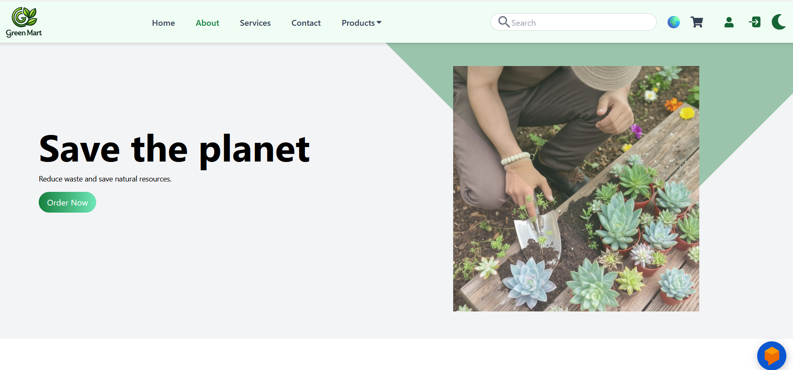
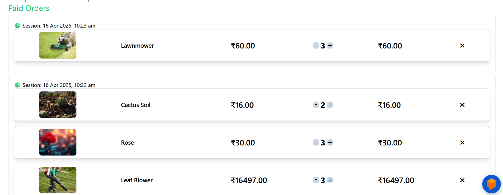
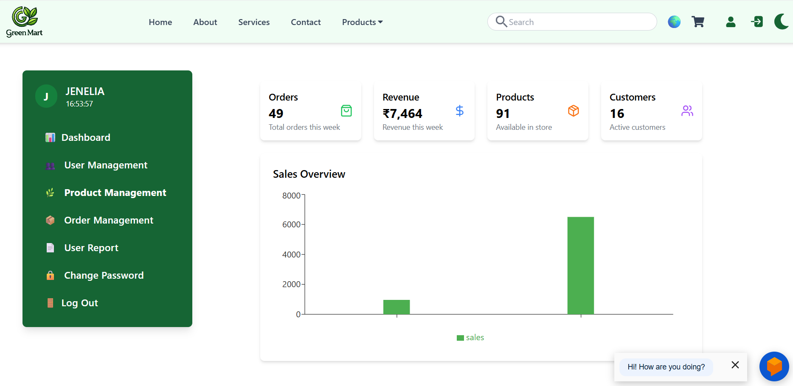

# Greenmart_Shopping_App
Greenmart is a modern, user-friendly eCommerce website.
# 🌿 GreenMart - Online Plant & Gardening eCommerce Website

GreenMart is a full-stack web application built using the MERN stack (MongoDB, Express.js, React.js, Node.js). It is designed to offer a seamless and user-friendly experience for customers to buy plants, gardening tools, and accessories online. The platform also provides a secure and efficient admin panel for managing products, orders, and users.

## 🚀 Features

### User Panel:
- 🛒 Browse, search, and filter gardening products
- 📝 View detailed product descriptions and images
- ❤️ Add items to cart and wishlist
- 📦 Place orders and track order history
- 💬 Submit feedback with optional image upload
- 🔒 Change password securely

### Admin Panel:
- 📋 Add, edit, and delete product listings
- 📊 View and manage customer orders
- 🔧 Respond to customer queries and feedback
- 📈 Generate sales and inventory reports
- 🔐 Secure login and authentication

## 🛠️ Technologies Used

| Layer       | Technology               |
|-------------|---------------------------|
| Frontend    | React.js, Tailwind CSS     |
| Backend     | Node.js, Express.js        |
| Database    | MySql                    |
| Authentication | JWT (JSON Web Tokens) |
| State Management | React Hooks, Context API |
| Routing     | React Router DOM           |

## 📸 Screenshots

### 🏠 Home Page

### 🛒 Cart Page

### 🧑‍💼 Admin Dashboard

